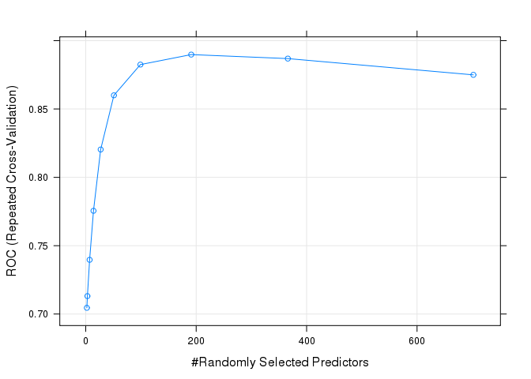
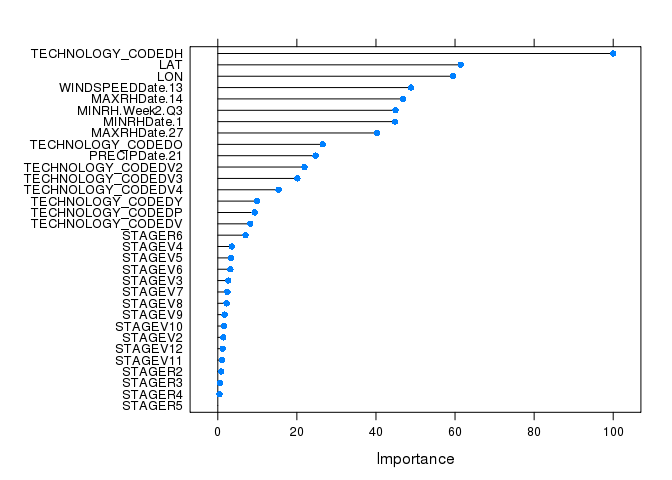

# Predictive Analytics Challenge
Rajasekhara Duvvuru Muni, Dmitry Grapov, Jeevan HS, Ravindra Pushker, Rupa V Nair  
March 26, 2016  

## Introduction
Insect damage in Corn (Zea mays L.) accounts for major yield loss in Brazil and across Latin America. Corn hybrids, with Bacillus thuringiensis (Bt) toxins provide significant protection against insect damage. However, additional factors such as weather also contribute to damage caused by insects. The objective of this study was to predict occurrence of insect damage to corn plants given genotype, plant growth stage, location and weather data.  
Accurate prediction of insect damage is expected to enable timely recommendations for precautionary integrated pest management control measures leading to reduced crop damage and losses.

*****

## Objectives
* Develop a predictive model for insect damage incidence given crop, weather and soil information. 
* Predict insect damage for the provided test data.

*****

## Data sources

1. Training data `data/OBVS.CSV` consisting of `7427` insect incidence observations in corn across Brazil (original source: [Velocity](http://velocity.monsanto.com/analytics-challenge/dataset/dataset.zip))

2. Daily weather data `data/weather_data.txt` across Brazil locations for three years, 2013, 2014 and 2015 (original source: [Velocity](http://velocity.monsanto.com/analytics-challenge/dataset/dataset.zip))

3. Soil type information for Brazil locations derived from the [soilDB](http://www.esalq.usp.br/gerd/) and integrated based on the geographical proximity to the observed fields.

4. Test data for 2015 and 2016 used to predict incidence of insect damage given the developed model `data/OBVS_EVAL.CSV` and `data/weather_eval.csv` (original source: [Velocity](http://velocity.monsanto.com/analytics-challenge/dataset/dataset.zip)).

*****

## Data integration and pre-processing

* Majority of the observations in the training data (`99%`) were for the insect `Spodoptera frugiperda`. Therefore predictive modeling was limited to `Spodoptera frugiperda`.

* General cleanup was done by removing spaces in the categorical data and formatting dates.

* Geographical coordinates (`Lat` and `Long`) in both observation and weather data were rounded to `5` decimal places.

* Weather data for `30 days` prior to the observed insect damage for each referenced fields was added based on information for coordinates within a `25km radius` for the location.

* Soil type from soilDB was integrated based on geographical proximity to observed field coordinates based on a` 25km radius`.

* The test data contained additional plant growth stages (`STAGE`) not present in the training data: `VN, V1, R7` and `VE`. These  stages were replaced with their closet counterparts present in the training data. The plant stage `VE` was further imputed based on observed plant stages for similar `TECHNOLOGY_CODED` and `DATE` within a `25km radius`.

*****

## Feature Generation

1. `Planting dates` were estimation based on the `DATE` of observation (observed insect damage) and crop `STAGE`.

2. Summarized weather features including: `sum, min, max, mean and median` were generated for `1, 2, 3` and `4` weeks prior to the `DATE` of the observation.

3. Discrete weather patterns or `barcodes` (H,M,L) were calculated for `1, 2, 3` and `4` weeks prior to the observed date of insect damage based on comparison of quantiles (variables labeled `Q1 to Q4`) for each weather parameter.

4. Area under the curve (`AUC`) for all weather parameters for `1 to 30 days` prior to the observed insect damage was calculated.

5. Missing test data weather information was imputed based on the median for present data within `25 km` matching the `DATE` of the observation.

*****

## Detailed description of the predictive modeling workflow
The complete workflow code is described in `Data_analysis_main.R`.

All data analysis functions can be found in `scripts/`.

```
##  [1] "01_DataIntegration.R"       "02_aggregateForWeek.R"     
##  [3] "03_weatherDataAggregate.R"  "04_calculateAUC.R"         
##  [5] "05_imputeData.R"            "06_fullRankModel.R"        
##  [7] "07_evaluateFullRankModel.R" "08_featureSelection.R"     
##  [9] "09_predictTestData.R"       "10_imputeSTAGE.R"          
## [11] "featureSelection.sh"        "fullRankModel.sh"
```

*****

## Overview of the predictive modeling workflow
Predictive models for insect damage  were developed using the `Random Forest` ensemble modeling algorithm. This approach was selected over others (e.g. SVM, PLS and ANN) due to the robust in-model cross-validation which limits overfitting, ease of tuning and parallelization.

Modeling was conducted using the following workflow:

1. Optimization of the `full rank` (all features) model `mtry` using repeated cross-validation `7 fold repeated 3 times` with an `mtry` tune length of `10` (`caret library`) based on the area under the receiver operator characteristic curve (ROC) for predictions.

2. Model validation using a held out `33%` of the training data as a pseudo-test set.

3. Selection of optimal predictive features using `recursive feature elimination` to generate a `feature selected` model.

4. Comparison of the `full rank` to `feature selected` model's performance.

5. Prediction of the test data insect damage based on the `feature selected` model.

*****

## Results
### Full rank model tunning
 
The optimal `mtry` was determined determined at 191

### Optimal predictive feature selection using the recursive feature elimination algorithm
Model cross-validation for each feature subset was conducted using `3 fold` repeated cross-validation repeated `3 times`. 

### Determination of the optimal number of predictive features
 

Optimal features were selected based on maximization of the cross-validated `Kappa` statistic.

### Selected features contribution to model predictive performance (`VIP`)
 

```
##  [1] "TECHNOLOGY_CODED" "STAGE"            "LON"             
##  [4] "WINDSPEEDDate.13" "PRECIPDate.21"    "MAXRHDate.14"    
##  [7] "LAT"              "MINRH.Week2.Q3"   "MAXRHDate.27"    
## [10] "MINRHDate.1"
```


### Comparison of `full_rank` and `selected_model` predictive performance for trainning and test data

model             tr.time     pred.time     total.time   tune        train.ROC   train.Sens   train.Spec   test.Accuracy   test.Kappa   test.Sensitivity   test.Specificity
----------------  ----------  ------------  -----------  ---------  ----------  -----------  -----------  --------------  -----------  -----------------  -----------------
full_rank_model   35.8 mins   0.315 secs    2150 secs    mtry=191        0.890        0.908        0.676           0.843        0.598              0.651              0.920
selected_model    1.27 mins   0.0734 secs   76.5 secs    mtry=8          0.897        0.910        0.679           0.843        0.598              0.646              0.923

Comparison of the `full_rank` and `selected_model` predictive performance (above, where) suggests that the reduced feature model (1.5%) has nearly equivalent predictive performance to the full rank model. Based on this observation the `selected_model` was used to predict insect incidence for the test data.

*****

## Conclusion

Our analysis revealed that, random forest based ensemble methods coupled with recursive feature elimination could predict insect damage occurrence with high accuracy (see above). The major predictors contributing to this model were technology coded followed by, location, stage and weather parameters.  When technology coded is H, there is high degree of probability of damage occurrence. Similarly of all the developmental stages, R6 seems to be the  most susceptible to insect damage. When it comes to the weather parameters, maximum relative humidity 14 days prior to the date of observation and windspeed on day 13 (prior to observation) are suggested to be good predictors for incidence of insect damage (14 and 13 days after respectively). Domain knowledge review of `Spodoptera frugiperda` information supports the observation that higher relative humidity in the field could enable an increase in the natural predator population of `Spodoptera frugiperda` and consequently reduce egg hatching and later incidence of insect damage. 
In conclusion our model could be used to design and recommend alternative integrated pest control measures in addition to existing technology recommendations. 

*****


# PAC Team

<h3><b>

* [Rajasekhara Duvvuru Muni](http://mysites.monsanto.com/Person.aspx?accountname=ASIA%2DPACIFIC%5CRDUVV)

* [Dmitry Grapov](http://mysites.monsanto.com/Person.aspx?accountname=NORTH%5FAMERICA%5CDDGRAP)

* [Jeevan HS](http://mysites.monsanto.com/Person.aspx?accountname=ASIA%2DPACIFIC%5CJHS)

* [Ravindra Pushker](http://mysites.monsanto.com/Person.aspx?accountname=ASIA%2DPACIFIC%5CRPUSH1)

* [Rupa V Nair](http://mysites.monsanto.com/Person.aspx?accountname=ASIA%2DPACIFIC%5CRNAIR1)
</h3></b>

## Citations (see `libraries` used in the code)


## About


```
## R version 3.1.2 (2014-10-31)
## Platform: x86_64-unknown-linux-gnu (64-bit)
## 
## locale:
##  [1] LC_CTYPE=en_US.UTF-8       LC_NUMERIC=C              
##  [3] LC_TIME=en_US.UTF-8        LC_COLLATE=en_US.UTF-8    
##  [5] LC_MONETARY=en_US.UTF-8    LC_MESSAGES=en_US.UTF-8   
##  [7] LC_PAPER=en_US.UTF-8       LC_NAME=C                 
##  [9] LC_ADDRESS=C               LC_TELEPHONE=C            
## [11] LC_MEASUREMENT=en_US.UTF-8 LC_IDENTIFICATION=C       
## 
## attached base packages:
## [1] stats     graphics  grDevices utils     datasets  methods   base     
## 
## other attached packages:
## [1] dplyr_0.4.3         knitr_1.11          randomForest_4.6-10
## [4] caret_6.0-52        ggplot2_2.0.0       lattice_0.20-29    
## 
## loaded via a namespace (and not attached):
##  [1] assertthat_0.1      BradleyTerry2_1.0-6 brglm_0.5-9        
##  [4] car_2.0-25          codetools_0.2-10    colorspace_1.2-6   
##  [7] DBI_0.3.1           digest_0.6.8        evaluate_0.8       
## [10] foreach_1.4.2       formatR_1.2         grid_3.1.2         
## [13] gtable_0.1.2        gtools_3.4.1        highr_0.5          
## [16] htmltools_0.3       iterators_1.0.7     lazyeval_0.1.10    
## [19] lme4_1.1-7          magrittr_1.5        MASS_7.3-44        
## [22] Matrix_1.1-5        mgcv_1.8-7          minqa_1.2.4        
## [25] munsell_0.4.2       nlme_3.1-119        nloptr_1.0.4       
## [28] nnet_7.3-11         parallel_3.1.2      pbkrtest_0.4-2     
## [31] plyr_1.8.3          quantreg_5.11       R6_2.1.0           
## [34] Rcpp_0.12.3         reshape2_1.4.1      rmarkdown_0.7      
## [37] scales_0.3.0        SparseM_1.6         splines_3.1.2      
## [40] stats4_3.1.2        stringi_0.4-1       stringr_1.0.0      
## [43] tools_3.1.2         yaml_2.1.13
```


